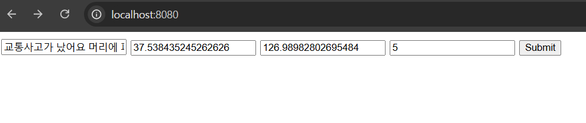
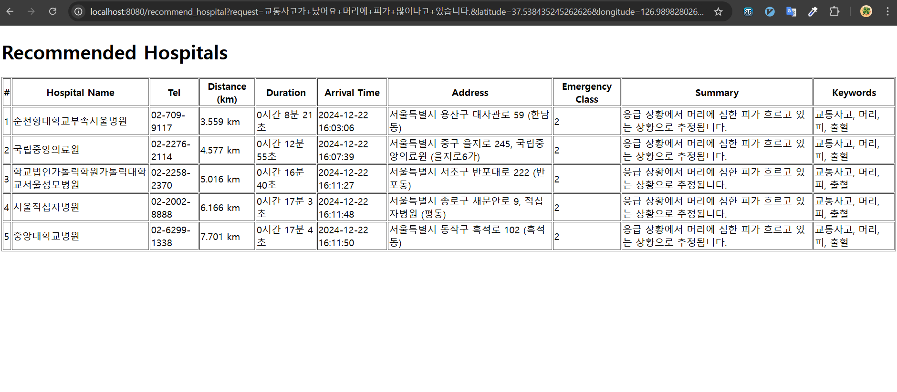

## 작업 내용
- 강사님이 주신 **`3일차_관리자추가버전_springboot`** 파일 중 API 응답 부분을 우리 API에 맞게 수정 했습니다.
    - 요청 파라미터 **`count`** 추가
    - 우리 API에 맞게 **`HospitalResponse`** 수정 등
- HTTP 클라이언트 라이브러리로 **`Feign Client`** 를 사용했습니다.
    - **`RestTemplate`** , **`WebClient`** 도 있지만 강사님은 **`Feign Client`** 를 사용
- 컨트롤러에서 Thymeleaf 템플릿 렌더링을 위해 반환값으로 ModelAndView 형식을 사용했습니다.
    - 강사님은 RestController가 아닌 **`Controller`** 사용
### / (root) 페이지

### Submit 버튼 누를 시 이동하는 페이지
